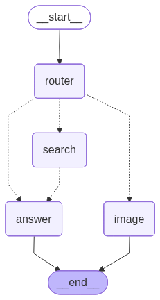

# 🤖 Multi-Agent LangGraph Chat

A full-stack AI chat application powered by **LangGraph** multi-agent orchestration with **Azure OpenAI** services.



## ✨ Features

- **Multi-Agent Orchestration** - LangGraph-based routing to specialized agents
- **Real-time Streaming** - Server-Sent Events (SSE) for live response streaming
- **Image Generation** - DALL-E 3 integration for AI-generated images
- **Search Grounding** - GPT-powered search responses
- **Modern Chat UI** - Beautiful dark-themed interface with Tailwind CSS

## 🏗️ Architecture

```
┌─────────────────────────────────────────────────────────────┐
│                     FRONTEND (Next.js)                       │
│                    http://localhost:3000                     │
│  ┌─────────────┐  ┌─────────────┐  ┌─────────────┐         │
│  │ ChatInput   │→ │ useChat     │→ │ MessageList │         │
│  │             │  │ (SSE)       │  │             │         │
│  └─────────────┘  └──────┬──────┘  └─────────────┘         │
└──────────────────────────┼──────────────────────────────────┘
                           │ POST /chat/stream
                           ▼
┌─────────────────────────────────────────────────────────────┐
│                     BACKEND (NestJS)                         │
│                    http://localhost:3001                     │
│                                                              │
│  ┌─────────────────────────────────────────────────────┐   │
│  │                    LangGraph                         │   │
│  │  ┌────────┐                                         │   │
│  │  │ Router │──┬──→ Answer Agent (GPT-4o)             │   │
│  │  └────────┘  ├──→ Search Agent → Answer             │   │
│  │              └──→ Image Agent (DALL-E 3)            │   │
│  └─────────────────────────────────────────────────────┘   │
└─────────────────────────────────────────────────────────────┘
```

### Agent Flow

| Path | Description |
|------|-------------|
| **Direct Answer** | `START` → `Router` → `Answer` → `END` |
| **Search + Answer** | `START` → `Router` → `Search` → `Answer` → `END` |
| **Image Generation** | `START` → `Router` → `Image` → `END` |

## 🚀 Quick Start

### Prerequisites

- Node.js 18+
- Azure OpenAI account with:
  - GPT-4o deployment
  - DALL-E 3 deployment

### 1. Clone the repository

```bash
git clone https://github.com/zaku1122/custom-agent-langgraph.git
cd custom-agent-langgraph
```

### 2. Setup Backend

```bash
cd backend
npm install

# Create .env file
cp .env.example .env
# Edit .env with your Azure credentials
```

### 3. Setup Frontend

```bash
cd frontend
npm install
```

### 4. Configure Environment Variables

Create `backend/.env`:

```env
# Azure OpenAI - Chat (GPT-4o)
AZURE_OPENAI_ENDPOINT=https://your-resource.openai.azure.com/
AZURE_OPENAI_API_KEY=your-api-key
AZURE_OPENAI_DEPLOYMENT=gpt-4o
AZURE_OPENAI_API_VERSION=2024-10-21

# Azure OpenAI - Image (DALL-E 3)
AZURE_OPENAI_IMAGE_ENDPOINT=https://your-resource.openai.azure.com/
AZURE_OPENAI_IMAGE_API_KEY=your-api-key
AZURE_OPENAI_IMAGE_DEPLOYMENT=dall-e-3
AZURE_OPENAI_IMAGE_API_VERSION=2024-02-01
```

### 5. Run the Application

**Terminal 1 - Backend:**
```bash
cd backend
npm run start:dev
```

**Terminal 2 - Frontend:**
```bash
cd frontend
npm run dev
```

### 6. Open the App

Visit [http://localhost:3000](http://localhost:3000)

## 📁 Project Structure

```
├── backend/
│   ├── src/
│   │   ├── chat/
│   │   │   ├── agents/
│   │   │   │   ├── answer.agent.ts    # GPT-4o Q&A
│   │   │   │   ├── search.agent.ts    # Search grounding
│   │   │   │   ├── image.agent.ts     # DALL-E 3 generation
│   │   │   │   └── langgraph.agent.ts # Graph orchestration
│   │   │   ├── chat.controller.ts     # API endpoints
│   │   │   └── chat.service.ts        # Business logic
│   │   └── config/
│   │       └── azure.ts               # Azure config
│   └── package.json
│
├── frontend/
│   ├── app/
│   │   ├── components/
│   │   │   ├── ChatContainer.tsx      # Main layout
│   │   │   ├── ChatInput.tsx          # Message input
│   │   │   ├── MessageList.tsx        # Message display
│   │   │   ├── MessageBubble.tsx      # Individual messages
│   │   │   ├── ImageDisplay.tsx       # Image viewer
│   │   │   └── SearchResultCard.tsx   # Search citations
│   │   ├── hooks/
│   │   │   └── useChat.ts             # SSE streaming hook
│   │   └── types/
│   │       └── chat.ts                # TypeScript types
│   └── package.json
│
└── README.md
```

## 🔧 API Endpoints

| Method | Endpoint | Description |
|--------|----------|-------------|
| POST | `/chat` | Non-streaming chat |
| POST | `/chat/stream` | SSE streaming chat |
| GET | `/chat/stream?message=` | SSE streaming (GET) |
| GET | `/chat/health` | Health check |

### Request Body

```json
{
  "message": "Your question here",
  "conversationHistory": [
    { "role": "user", "content": "Previous message" },
    { "role": "assistant", "content": "Previous response" }
  ]
}
```

## 🎯 Usage Examples

### Ask Questions
```
"What is quantum computing?"
"Explain machine learning in simple terms"
```

### Search (triggers Search Agent)
```
"What are the latest AI developments?"
"Tell me about recent tech news"
```

### Generate Images (triggers Image Agent)
```
"Generate an image of a sunset over mountains"
"Create a picture of a futuristic city"
"Draw a cute robot"
```

## 🛠️ Tech Stack

### Backend
- **NestJS** - Node.js framework
- **LangGraph** - Multi-agent orchestration
- **Azure OpenAI** - GPT-4o & DALL-E 3
- **TypeScript** - Type safety

### Frontend
- **Next.js 14** - React framework
- **Tailwind CSS** - Styling
- **TypeScript** - Type safety
- **SSE** - Real-time streaming

## 📊 LangGraph Visualization

Generate the graph visualization:

```bash
cd backend
npx tsx visualize-graph.ts
```

This creates:
- `graph-visualization.png` - PNG image
- `graph-visualization.md` - Mermaid diagram

## 🧪 Testing

Test individual agents:

```bash
cd backend
npm run test:agents
```

## 📝 License

MIT

## 🤝 Contributing

1. Fork the repository
2. Create a feature branch
3. Commit your changes
4. Push to the branch
5. Open a Pull Request

---

Built with ❤️ using LangGraph + Azure OpenAI

