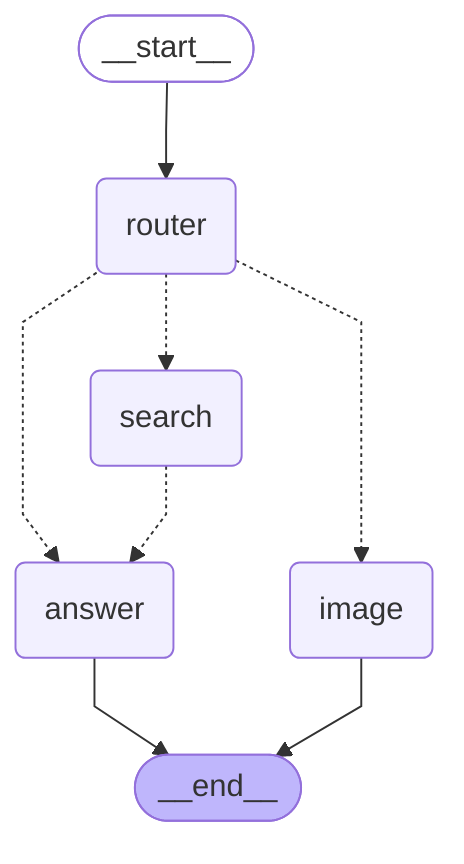

# LangGraph Multi-Agent Visualization

## Mermaid Diagram

## How to View

1. **VS Code**: Install "Markdown Preview Mermaid Support" extension
2. **GitHub**: Paste in any .md file - GitHub renders Mermaid natively
3. **Online**: Go to https://mermaid.live and paste the diagram code
